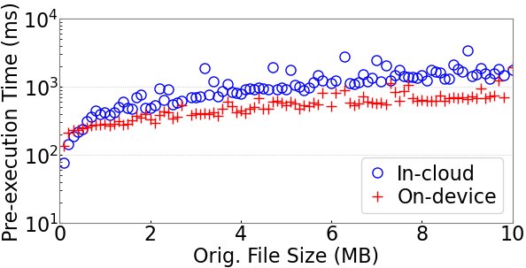
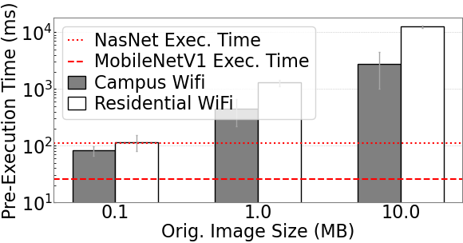
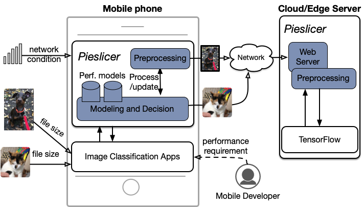

# PieSlicer

PieSlicer models the pre-execution workflow for deep learning models and uses this to dynamically place preprocessing execution.  
Work is published as part of ICPE'21 program/proceedings.

## Motivation

Deep learning pre-execution time for mobile devices consists of the latency of transferring the raw input data from mobile devices to cloud-based servers, as well as performing any pre-inference transformations.
The order of these operations can have significant ramifications for latency, with on-device preprocessing and in-cloud preprocessing differing by over an order of magnitude in latency for difference images, as shown below.


 

Further, this pre-execution latency is in many cases longer than the execution latency of cloud-based models, making this transfer time the majority of the overall response time.


 

PieSlicer reduces this pre-execution latency by characterizing each of the components of pre-execution latency to make dynamic preprocessing location decisions.

 


## Key Contributions

- We identify and characterize pre-execution time for in-cloud deep learning inference for mobile devices.  By modeling this data we should that it can be well characterized by using low-overhead linear regression models.
- We implement a prototype system, PieSlicer, that takes advantage of these linear regression models to make fast, yet accurate, pre-execution location decisions.
- We show that by using our system PieSlicer we can reduce the pre-execution latency by up to 217.2ms, and achieve an $F_1$ score of 0.99.

## Citation

```
@inproceedings{ogden2021pieslicer,
  title={PieSlicer: Dynamically Improving Response Time for Cloud-based CNN Inference},
  author={Ogden, Samuel S. and Kong, Xiangnan and Guo, Tian},
  booktitle={12th ACM/SPEC International Conference on Performance Engineering},
  year={2021},
  organization={Association for Computing Machinery (ACM)}
}
```

