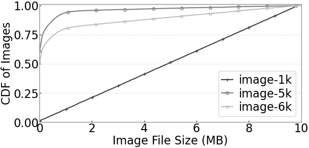
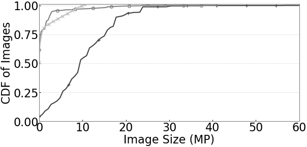

# PieSlicer Datasets

Datasets are available at the following links.
Future details and description to be added.

## Dataset Links
- [_image-1k_](https://web.cs.wpi.edu/~ssogden/datasets/PieSlicer/image-1k.tgz) (SHA256 69b4b1850abffc490d389fa04d97299ce6db432df119acb7defcd4d381ca43e9)
- [_image-5k_](https://web.cs.wpi.edu/~ssogden/datasets/PieSlicer/image-5k.tgz) (SHA256 07563991cc8c0b0a5443cb05ff577b5dc1eee2dbe628f1e18424ef7991c78092)

## Dataset details

Both of our datasets were generated by a script (see `../src/generateFlickr/`).
This script works by searching for a random word selected from a word list and processing the first 1000 images from this search.

Each of the two datasets below have different criteria upon which we select images.
Note, we also include _image-6k_ which combines both _image-1k_ and _image-5k_ into a single dataset.

### Image-5k Dataset

The _image-5k_ dataset selects every image until it has 5000 total images, downloading the original size of each one.
These images have a wide size distribution, but tend to be heavily skewed towards smaller images.

### Image-1k Dataset

The image-1k dataset is design to have data sizes evenly distributed across a range from 0KB to 10MB.
To do this we divided our range into buckets of 100KB in size each containing 10 images.
For each image if it was of a size of an unfilled bucket we selected it, and if not we moved on to the next image.

### Dataset analysis

 

 
